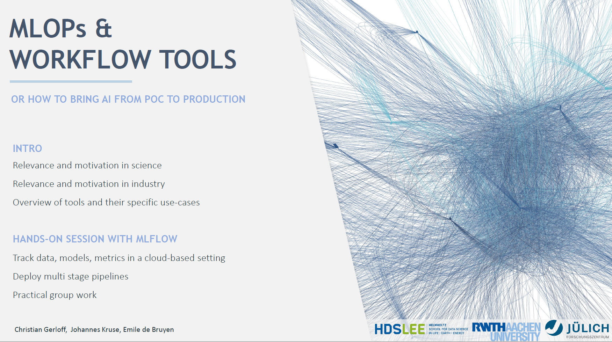

Welcome to the workshop!   

The materials will we updated after the course.
Including some additional information.

### Get started with the course materials
To interactively work with the materials, you can open this notebook in  [google colab](https://https://colab.research.google.com/). All you need is a google account. Besides the server application, all course materials are prepared for direct use in google colab. No local installations are required. In the readme and during the course, we will provide you with an additional how-to for local or remote installations.   

### Credentials for cloud-hosted servers and storage

To allow interactions during the workshop and to provide a realistic server setup for labs or industrial use-cases, we will use a cloud-hosted storage and mlflow server. Both are protected. Every participant will receive his/her own credentials for the mlflow server via mail beforehand. The credentials are used to avoid collisions between runs so please use your own credentials. You should have received:

* MLFLOW_TRACKING_USERNAME
* MLFLOW_TRACKING_PASSWORD
* AWS_ACCESS_KEY_ID
* AWS_SECRET_ACCESS_KEY