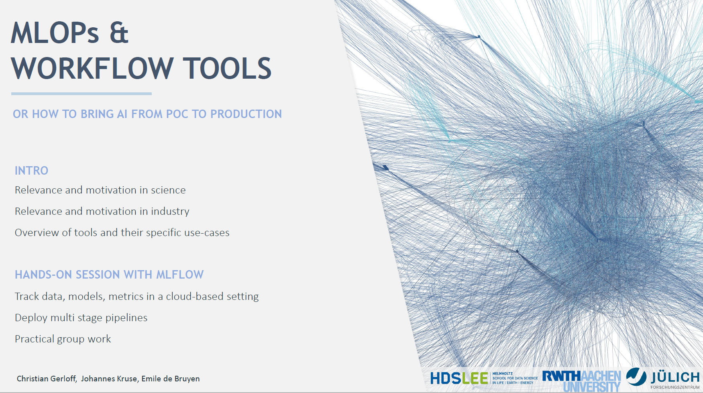
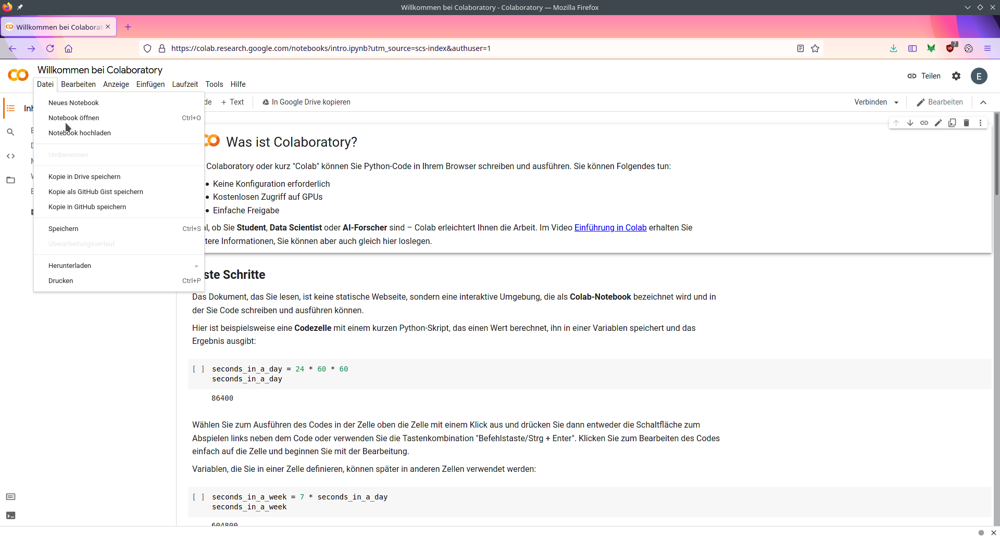
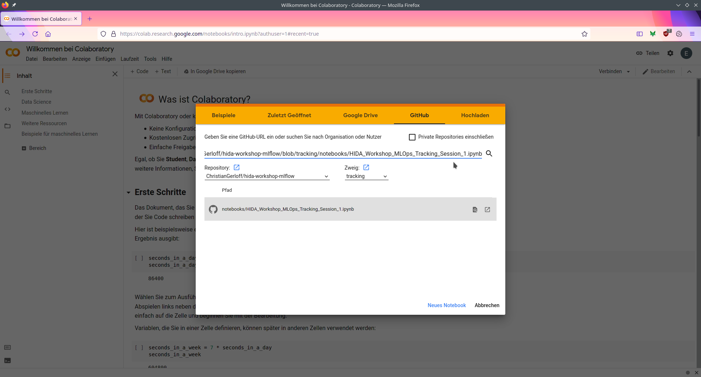
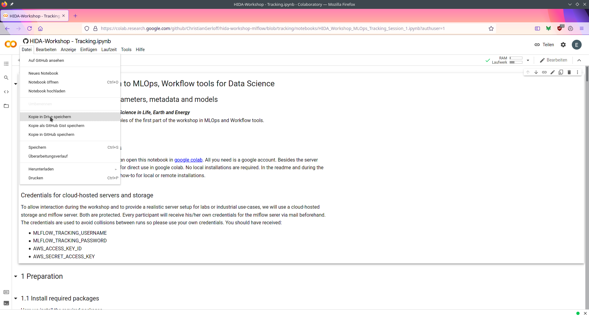

Welcome to the workshop!   

Welcome to the first HDS-LEE student organised Workshop! Goal of the
Workshop is to give an introduction and overview of different workflow
tools for Data Science and Machine Learning pipelines. The Workshop
focuses primarily on the MLflow package.  
The materials will we updated after the course.
Including some additional information.  

### Get started with the course materials
To interactively work with the materials, you can open this notebook in  [google colab](https://https://colab.research.google.com/). All you need is a google account. Besides the server application, all course materials are prepared for direct use in google colab. No local installations are required. In the readme and during the course, we will provide you with an additional how-to for local or remote installations.   

### Credentials for cloud-hosted servers and storage

To allow interactions during the workshop and to provide a realistic server setup for labs or industrial use-cases, we will use a cloud-hosted storage and mlflow server. Both are protected. Every participant will receive his/her own credentials for the mlflow server via mail beforehand. The credentials are used to avoid collisions between runs so please use your own credentials. You should have received:

* MLFLOW_TRACKING_USERNAME
* MLFLOW_TRACKING_PASSWORD
* AWS_ACCESS_KEY_ID
* AWS_SECRET_ACCESS_KEY

# Table of contents

- [Table of contents](#table-of-contents)
  - [Date](#date)
  - [Schedule](#schedule)
  - [Location](#location)
- [Preparation](#preparation)
  - [Groups](#groups)
  - [Google/Colab account](#googlecolab-account)
  - [MLflow server and account](#mlflow-server-and-account)
- [Opening the notebooks in Colab](#opening-the-notebooks-in-colab)
  - [Copy from GitHub repository](#copy-from-github-repository)
- [Purpose of this repository](#purpose-of-this-repository)
- [Team](#team)
  - [Presentation and Hands-on Training](#presentation-and-hands-on-training)
  - [Organisation and Links](#organisation-and-links)
  - [Technical Support and Questions](#technical-support-and-questions)
        Training](#presentation-and-hands-on-training)
    -   [Organisation and Links](#organisation-and-links)
    -   [Technical Support and
        Questions](#technical-support-and-questions)

## Date

June 16th, 2021 from 10:00 to 15:00 CEST.

## Schedule

<table border="2" cellspacing="0" cellpadding="6" rules="groups" frame="hsides">
<colgroup>
<col  class="org-left" />
<col  class="org-left" />
</colgroup>
<tbody>
<tr>
<td class="org-left">10:00 - 10:15</td>
<td class="org-left">Welcome and Introduction</td>
</tr>
<tr>
<td class="org-left">10:15 - 11:00</td>
<td class="org-left">Presentation "Workflow Tools: MLflow, DVC and Apache Airflow"</td>
</tr>
<tr>
<td class="org-left">11:00 - 12:00</td>
<td class="org-left">Hands-on Session: Introduction and Code Tour</td>
</tr>
<tr>
<td class="org-left">12:00 - 13:00</td>
<td class="org-left">Lunch</td>
</tr>
<tr>
<td class="org-left">13:00 - 14:30</td>
<td class="org-left">Hands-on Session: Group work</td>
</tr>
<tr>
<td class="org-left">14:30 - 15:00</td>
<td class="org-left">Wrap-up and Feedback</td>
</tr>
</tbody>
</table>

[PDF Schedule](./Schedule HDS-LEE Workshop 2021 - Workflow Tools.pdf)

## Location

Online (Zoom). Link to follow in email, else contact Ramona Kloß.

# Preparation

## Groups

To ensure the quality and experience of the planned group work segments,
please fill out the form on located at
<https://docs.google.com/spreadsheets/d/13dDIkX1eO34eneFCOz5f2r3kiD3d-Jz9gG-AAFd8PxE/edit?usp=sharing>.

## Google/Colab account

Please ensure that you have a Google account ready to work with Colab.
This will ensure that you can follow along the in the hands-on session.

## MLflow server and account

[Link to MLflow server frontend.](http://3.125.220.21:80/)

An account to the MLflow server will be made for each participant and
the details emailed. Please check that the login works before the
course. (Should something not work, please contact
<e.de.bruyn@fz-juelich.de>).

# Opening the notebooks in Colab

## Copy from GitHub repository

Go to <https://colab.research.google.com>, and click on 'File' and then
'Open Notebook'.

In the address field, enter the link to the (first) notebook hosted on
GitHub:
(<https://github.com/ChristianGerloff/hida-workshop-mlflow/blob/tracking/notebooks/HIDA_Workshop_MLOps_Tracking_Session_1.ipynb>).

After entering the whole URL to the notebook (including filetype), click
on the looking glass symbol or hit 'enter' to open the Notebook.

To enable saving your progress and changes, save a copy to your Google
Drive (or your own GitHub account) using the 'File' dialogue menu.

# Purpose of this repository

This repository is to house the Jupyter Notebooks that contain practical
examples of implementing an MLflow workflow, thus serving as a reference
after the fact.

# Team

## Presentation and Hands-on Training

-   Christian Gerloff
-   Johannes Kruse

## Organisation and Links

-   Dr. Ramona Kloß

## Technical Support and Questions

-   Emile de Bruyn